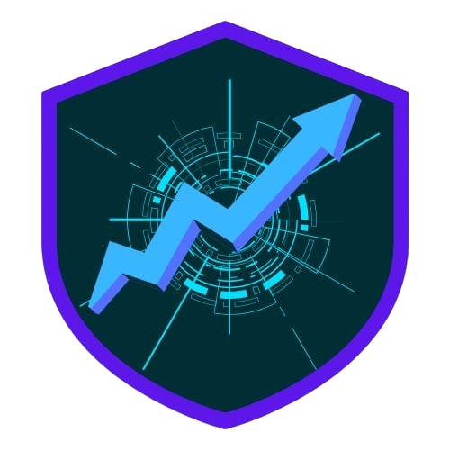

# DDoSGuard 🛡️

An interactive educational platform for learning about DDoS attacks, defense mechanisms, and cybersecurity best practices. Built as a React frontend with Flask backend for comprehensive DDoS simulation and monitoring.



## 🚀 Features

### Interactive Simulations
- **DDoS Attack Simulation**: Experience distributed denial-of-service attacks with real-time visualization
- **DoS Attack Simulation**: Single-source attack patterns and mitigation
- **Layer 3/4 Attacks**: Network and transport layer attacks (SYN floods, UDP floods)
- **Layer 7 Attacks**: Application layer attacks (HTTP floods, Slowloris)
- **Defense Mechanisms**: WAF, rate limiting, geo-blocking, behavioral analysis

### Advanced Defense Features
- **Real-time Threat Detection**: Machine learning-based anomaly detection
- **Adaptive Defense Systems**: Self-learning security that adapts to attack patterns
- **Incident Response**: Automated protocols for handling detected attacks
- **Multi-layer Protection**: Comprehensive defense strategies

### Educational Content
- **Interactive Guides**: Step-by-step learning modules
- **Real-world Scenarios**: Case studies of famous DDoS attacks
- **Code Examples**: Python implementations for attacks and defenses
- **Visual Analytics**: Charts and graphs for traffic analysis

### Monitoring Integration
- **PyDDOSGuard Tool**: Integrated Python monitoring system
- **Real-time Dashboard**: Live traffic analysis and alerts
- **Connection Monitoring**: Process-level network tracking
- **Threat Intelligence**: Advanced threat scoring and reporting

## 🛠️ Tech Stack

### Frontend
- **React 19** - Modern JavaScript framework
- **React Router** - Client-side routing
- **Tailwind CSS** - Utility-first CSS framework
- **Framer Motion** - Animation library
- **React Google Charts** - Data visualization
- **React Syntax Highlighter** - Code highlighting

### Backend
- **Flask** - Python web framework
- **PyDDOSGuard** - Custom DDoS monitoring tool

### Development Tools
- **Create React App** - Build setup
- **ESLint** - Code linting
- **PostCSS** - CSS processing
- **Autoprefixer** - CSS vendor prefixing

## 📦 Installation

### Prerequisites
- Node.js 16+
- npm or yarn
- Python 3.8+ (for backend)
- Git

### Frontend Setup

1. **Clone the repository**
   ```bash
   git clone https://github.com/yourusername/ddosguard-frontend.git
   cd ddosguard-frontend
   ```

2. **Install dependencies**
   ```bash
   npm install
   ```

3. **Start development server**
   ```bash
   npm start
   ```

   The app will run on [http://localhost:3080](http://localhost:3080) (configured for port 3080)

### Backend Setup

1. **Navigate to backend directory**
   ```bash
   cd ../backend  # Assuming backend is in sibling directory
   ```

2. **Install Python dependencies**
   ```bash
   pip install -r requirements.txt
   ```

3. **Run Flask backend**
   ```bash
   python app.py
   ```

## 🚀 Available Scripts

### Frontend Scripts
```bash
npm start          # Start development server
npm run build      # Build for production
npm run build:prod # Production build with optimizations
npm test           # Run tests
npm run eject      # Eject from Create React App
```

### Backend Scripts
```bash
python run.py      # Start Flask development server
```

## 📁 Project Structure

```
ddosguard-frontend/
├── public/
│   ├── app/           # Monitoring tool files
│   │   ├── pyddosguard.py
│   │   ├── monitoring.md
│   │   └── executables/
│   ├── img/           # Static images
│   └── index.html     # HTML template
├── src/
│   ├── api/           # API integration
│   ├── components/    # Reusable components
│   │   ├── navbar.js
│   │   ├── footer.js
│   │   ├── terminal.js
│   │   └── ResponseSimulator.js
│   ├── context/       # React context
│   ├── pages/         # Page components
│   │   ├── home.js
│   │   ├── DocsPage.js
│   │   ├── GuidesPage.js
│   │   ├── SimulationPage.js
│   │   └── simulations/  # Simulation pages
│   │       ├── DDosPage.js
│   │       ├── RateLimitPage.js
│   │       ├── CSRFPage.js
│   │       └── ...
│   ├── styles/        # CSS styles
│   │   ├── global.css
│   │   ├── navbar.css
│   │   └── terminal.css
│   ├── App.js         # Main app component
│   └── index.js       # App entry point
├── package.json
├── tailwind.config.js
└── README.md
```

## 🎯 Usage

### Getting Started
1. Visit the home page to learn about DDoS attacks
2. Navigate to **Simulations** → **Introduction** to begin
3. Choose from various attack simulations
4. Activate defense systems to see mitigation in action
5. Monitor real-time logs in the terminal component

### Simulation Types

#### Attack Simulations
- **Normal Traffic**: Baseline legitimate user behavior
- **DoS Attack**: Single-source overwhelming traffic
- **DDoS Attack**: Multi-source distributed attack
- **Layer 3/4**: Network infrastructure attacks
- **Layer 7**: Application layer attacks

#### Defense Simulations
- **Rate Limiting**: Request throttling per IP
- **Web Application Firewall**: Pattern-based blocking
- **Geo-blocking**: Geographic filtering
- **Behavioral Analysis**: Anomaly detection
- **Machine Learning**: Adaptive threat detection

### Monitoring Integration

The platform integrates with PyDDOSGuard for advanced monitoring:

```bash
# Run the monitoring tool
python pyddosguard.py

# Features include:
# - Real-time connection tracking
# - Traffic rate analysis
# - Process monitoring
# - Alert generation
# - JSON data export
```

## 🔧 Configuration

### Environment Variables
Create a `.env` file in the root directory:

```env
REACT_APP_API_URL=http://localhost:5000/api
REACT_APP_BASENAME=/ddosguard
PORT=3080
```

### Build Configuration
Modify `package.json` scripts for custom build processes:

```json
{
  "homepage": "/ddosguard",
  "scripts": {
    "build:prod": "GENERATE_SOURCEMAP=false react-scripts build"
  }
}
```

## 📊 API Integration

The frontend communicates with Flask backend via REST API:

### Endpoints
- `GET /api/simulations` - Get available simulations
- `POST /api/simulate` - Start simulation
- `GET /api/monitoring/data` - Real-time monitoring data
- `POST /api/defense/activate` - Activate defense systems

### Example API Call
```javascript
const response = await fetch('/api/simulations');
const simulations = await response.json();
```

## 🎨 Customization

### Styling
- **Tailwind CSS**: Utility classes for rapid styling
- **Custom CSS**: Component-specific styles in `src/styles/`
- **Theme**: Dark theme optimized for cybersecurity interface

### Components
- **Modular Design**: Reusable components in `src/components/`
- **Lazy Loading**: Performance optimization with React.lazy()
- **Context API**: State management for simulation data

## 🧪 Testing

```bash
# Run frontend tests
npm test

# Run backend tests
python -m pytest
```

## 🚀 Deployment

### Production Build
```bash
npm run build:prod
```

### Serve Static Files
```bash
npm install -g serve
serve -s build -l 3000
```

### Docker Deployment
```dockerfile
FROM node:16-alpine
WORKDIR /app
COPY package*.json ./
RUN npm ci --only=production
COPY . .
RUN npm run build
EXPOSE 3000
CMD ["npm", "start"]
```

## 🤝 Contributing

1. Fork the repository
2. Create a feature branch (`git checkout -b feature/amazing-feature`)
3. Commit changes (`git commit -m 'Add amazing feature'`)
4. Push to branch (`git push origin feature/amazing-feature`)
5. Open a Pull Request

### Development Guidelines
- Follow React best practices
- Use functional components with hooks
- Maintain consistent code style
- Add tests for new features
- Update documentation

## 📝 License

This project is licensed under the MIT License - see the [LICENSE](LICENSE) file for details.

## 🙏 Acknowledgments

- **React Community** - For the amazing framework
- **Tailwind CSS** - For utility-first styling
- **Flask** - For robust backend framework
- **Open Source Security Tools** - For inspiration and learning

## 📞 Support

For questions or issues:
- Create an issue on GitHub
- Check the documentation in `/docs`
- Review simulation guides in `/guides`

---

**Built with ❤️ for cybersecurity education**
